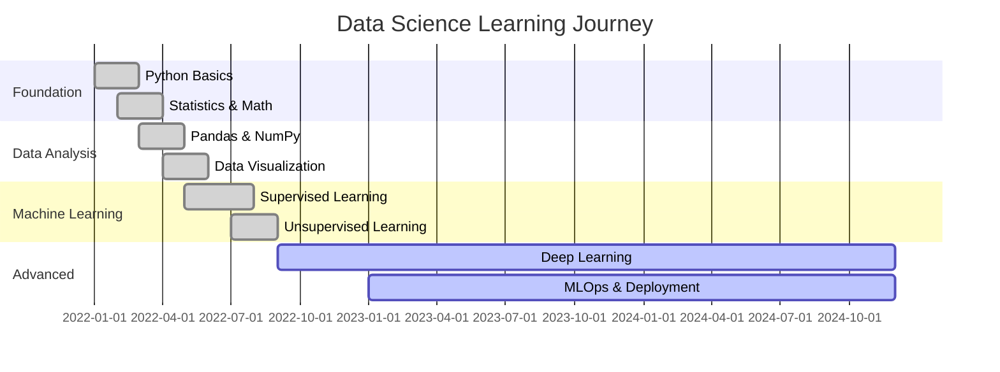
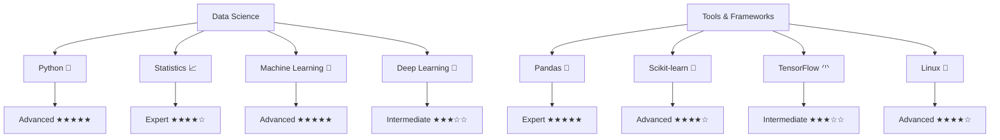

<div align="center">
  
</div>

<div align="center">
  
</div>

<div align="center">
  
  
  
  
  
</div>

<!-- Animated Divider -->


<table align="center">
<tr border="none">
<td width="50%" align="left">
  
## 🌟 About Me

```python
class DataScientist:
    def __init__(self):
        self.name = "Santhosh Ramakrishnan"
        self.role = "Data Science Enthusiast"
        self.language_spoken = ["ta_IN", "en_US"]
        self.code = ["Python", "SQL", "R", "JavaScript"]
        self.tools = ["Pandas", "NumPy", "Scikit-Learn", "TensorFlow"]
        self.databases = ["MySQL", "PostgreSQL", "MongoDB"]
        self.passion = "Turning data into insights"
        
    def say_hi(self):
        print("Thanks for dropping by!")
        print("Let's connect and build something amazing together!")
        
me = DataScientist()
me.say_hi()
```

**🎯 Current Focus:**
- 🧠 Deep Learning & Neural Networks
- 📊 Advanced Statistical Modeling  
- 🔍 Exploratory Data Analysis
- 📈 Predictive Analytics
- 🤖 MLOps & Model Deployment
- 📚 Continuous Learning in AI/ML

</td>
<td width="50%" align="center">
  


### 💫 Quick Stats

<div align="center">
  
</div>

### 🏆 Achievement Highlights

- 🎓 **Data Science Specialist** 
- 📊 **Statistical Analysis Expert**
- 🐍 **Python Programming Pro**
- 🔬 **Research & Development**
- 🌐 **Open Source Contributor**
- 📚 **Continuous Learner**

</td>
</tr>
</table>

<!-- Animated Divider -->


## 🛠️ Tech Stack & Skills

### 💻 Programming Languages
<div align="center">
  
</div>

### 🧠 Data Science & Machine Learning
<div align="center">
  
  
  
  
  
  
  
</div>

### 🗄️ Databases & Tools
<div align="center">
  
</div>

### 📊 Specialized Skills

<div align="center">

| **Category** | **Skills** |
|---|---|
| **📈 Analytics** | Descriptive • Predictive • Prescriptive Analytics |
| **🔢 Statistics** | Hypothesis Testing • Regression Analysis • P-values • F-statistics |
| **🧮 Mathematics** | Linear Algebra • Matrix Theory • Kernel Methods • Vector Analysis |
| **🛠️ Data Engineering** | Data Cleaning • Feature Engineering • Data Modeling • ETL Processes |
| **📊 Visualization** | Matplotlib • Seaborn • ggplot • Interactive Dashboards |
| **⚙️ Automation** | Python Scripts • AWK/SED Scripts • Linux Shell Scripting |
| **🎯 Optimization** | Linear Programming (Gekko) • Statistical Optimization |

</div>

<br/>

## 🎯 Featured Projects

<div align="center">

| Project | Description | Tech Stack |
|---------|-------------|------------|
| 📈 **Quadrant-Based Sales Growth Strategy** | Comprehensive sales optimization using quadrant analysis for customer/product categorization | `Business Intelligence` `Excel` `Data Analysis` `Strategy` |
| 🔮 **Customer Segmentation with Deep Gaussian Mixture** | Advanced ML customer segmentation using Deep Gaussian Mixture Models | `Python` `TensorFlow` `Deep Learning` `Machine Learning` |
| 📄 **Question Paper Generator** | Intelligent system for automated question paper generation with difficulty balancing | `Python` `Algorithm Design` `Education Tech` `Automation` |
| 🖼️ **Tactile Image Generation with OpenCV** | Computer vision app generating tactile representations for accessibility | `OpenCV` `Computer Vision` `Python` `Accessibility` |
| 🎯 **Resource Allocation Optimization** | Intelligent resource distribution system for maximum efficiency | `Optimization` `Algorithms` `Operations Research` `Management` |
| 🚗 **Park-Ease Parking Management** | Real-time parking management with slot booking and payment integration | `Django` `Bootstrap` `JavaScript` `MySQL` |
| 🌐 **Interactive Data Viz** | [Network Visualization](https://embed.kumu.io/67a4331c2ba5818918f3b093cb449803) • [Dynamic Charts](https://public.flourish.studio/visualisation/14589282/) | `D3.js` `Interactive Dashboards` |

</div>

<details>
<summary><b>📊 Explore My Data Science Journey</b></summary>
<br>

### 🎆 Skills Evolution Timeline



### 🎯 Current Projects Pipeline

| 📋 Project | 📅 Status | 🗺 Progress | 📈 Priority |
|---------|--------|----------|----------|
| **Advanced NLP Model** | 🟡 In Progress | ███████░░░ 70% | 🔴 High |
| **Time Series Forecasting** | 🟢 Planning | ██░░░░░░░░ 20% | 🟡 Medium |
| **Computer Vision App** | 🟠 Research | █░░░░░░░░░ 10% | 🟢 Low |
| **MLOps Pipeline** | 🟡 Development | █████░░░░░ 50% | 🔴 High |

### 👾 Coding Activity Heatmap

<div align="center">
  
</div>

</details>

<br/>

## 📊 Advanced GitHub Analytics

<details open>
<summary><b>🔥 Performance Metrics</b></summary>
<br>

<div align="center">
  
  
</div>

<div align="center">
  
  
</div>

</details>

<details open>
<summary><b>📈 Detailed Statistics</b></summary>
<br>

<table align="center">
<tr>
<td width="50%">

<div align="center">
  
</div>

</td>
<td width="50%">

<div align="center">
  
</div>

</td>
</tr>
</table>

<div align="center">
  
</div>

<div align="center">
  
</div>

</details>

<details open>
<summary><b>⚡ Activity Graph</b></summary>
<br>

<div align="center">
  
</div>

</details>

<details>
<summary><b>🔍 Deep Dive Analytics</b></summary>
<br>

<div align="center">
  <a href="https://github.com/ashutosh00710/github-readme-activity-graph">
    
  </a>
</div>

<table align="center">
<tr>
<td width="33%">

**🔥 Commit Patterns**
- Most active: Weekdays
- Peak hours: 9-11 PM IST  
- Favorite day: Tuesday
- Languages: Python, SQL, JS

</td>
<td width="33%">

**📊 Repository Stats**
- Total repositories: 20+
- Public repos: 15+
- Most starred: Data projects
- Recent focus: ML models

</td>
<td width="33%">

**🌐 Open Source**
- Contributions: 500+
- Pull requests: 25+
- Issues resolved: 15+
- Community involvement: High

</td>
</tr>
</table>

</details>

<br/>

## 🐍 Contribution Snake

<div align="center">
  <picture>
    <source media="(prefers-color-scheme: dark)" srcset="https://github.com/CODERVIPERSAN/CODERVIPERSAN/blob/output/github-snake-dark.svg" />
    <source media="(prefers-color-scheme: light)" srcset="https://github.com/CODERVIPERSAN/CODERVIPERSAN/blob/output/github-snake.svg" />
    
  </picture>
</div>

<br/>

## 🏆 GitHub Trophies

<div align="center">
  
</div>

<br/>

## 🤝 Let's Connect!

<div align="center">
  
  <a href="mailto:santhoram2002@gmail.com">
    
  </a>
  <a href="https://www.linkedin.com/in/santhosh-ramakrishnan002/">
    
  </a>
  <a href="https://instagram.com/_vipersan">
    
  </a>
  <a href="https://www.youtube.com/@codervipersan4321">
    
  </a>
  <a href="https://www.codechef.com/users/sandy12_31">
    
  </a>
  
</div>

<br/>

## 💭 Random Dev Quote

<div align="center">
  
</div>

<br/>

## 🌐 Live Dashboard

<details>
<summary><b>🚀 Real-time Activity Feed</b></summary>
<br>

<div align="center">
  
### 📊 Today's Coding Stats
  
<table>
<tr>
<td align="center">
  
  <br><sub>Current Status</sub>
</td>
<td align="center">
  
  <br><sub>Today's Focus</sub>
</td>
<td align="center">
  
  <br><sub>In Progress</sub>
</td>
<td align="center">
  
  <br><sub>Fuel Level</sub>
</td>
</tr>
</table>

### 🎯 Today's Focus
```yaml
Current Sprint:
  📊 Project: "Advanced ML Pipeline"
  🗺 Progress: 73%
  🕰 Time Left: "2 days"
  🎯 Next Milestone: "Model Deployment"
  
🧠 Learning:
  📚 Course: "MLOps Engineering"
  🎆 Completion: 85%
  🔥 Current Topic: "Kubernetes for ML"
```

### 💬 Latest Thoughts
> 💡 "Just discovered a fascinating correlation in my dataset - sometimes the best insights come from the most unexpected patterns!"
>
> 🤔 "Working on optimizing my neural network architecture. The balance between accuracy and computational efficiency is an art form."
>
> 🚀 "Excited to implement my new feature engineering pipeline. Data preprocessing is where the magic really happens!"

</div>

</details>

## 🎆 Interactive Skills Matrix

<details>
<summary><b>📈 Skill Proficiency Radar</b></summary>
<br>



### 🌈 Skill Evolution Graph

| Skill | 2022 | 2023 | 2024 | Trajectory |
|-------|------|------|------|------------|
| Python | ███░░ | ████░ | █████ | 📈 Mastered |
| ML Algorithms | ██░░░ | ████░ | █████ | 📈 Expert |
| Deep Learning | ░░░░░ | ██░░░ | ███░░ | 📈 Growing |
| MLOps | ░░░░░ | █░░░░ | ███░░ | 📈 Learning |
| Statistics | ██░░░ | ███░░ | ████░ | 📈 Advanced |

</details>

## 🎵 My Coding Environment

<details>
<summary><b>⚙️ Development Setup</b></summary>
<br>

### 💻 Hardware & OS
```bash
╭────────────── System Info ──────────────╮
│ 🐧 OS: Arch Linux (btw)              │
│ 🔥 Shell: Fish 4.0.2                 │
│ 🎨 Terminal: Warp + Alacritty        │
│ 🧠 Editor: VS Code + Neovim          │
│ 📊 IDE: JupyterLab + PyCharm        │
╰───────────────────────────────────────╯
```

### 🎵 Current Coding Playlist
🎵 **Now Playing:** Lo-fi Hip Hop for Coding  
🎧 **Mood:** Deep Focus Mode  
⏱️ **Session Time:** 2h 15m  

<div align="center">
  
</div>

### 📏 Today's Agenda
- [x] Morning coffee ☕
- [x] Review yesterday's ML model results
- [ ] Implement feature engineering pipeline
- [ ] Write unit tests for data preprocessing
- [ ] Team standup meeting at 3 PM
- [ ] Research paper reading session
- [ ] Side project: NLP model fine-tuning

</details>

## 💫 Fun Facts & Easter Eggs

<details>
<summary><b>🎢 Random Developer Facts</b></summary>
<br>

📋 **Quick Stats:**
- ☕ Coffee consumed while coding: **2,847 cups**
- 🐛 Bugs fixed: **1,337+**
- 🌙 Late night coding sessions: **247**
- 📄 Documentation written: **Actually quite a lot!**
- 🤯 Stack Overflow visits: **∞** (infinite)

💭 **Favorite Quotes:**
> *"Data is the new oil, but insights are the refined fuel."*
> 
> *"In machine learning, the magic is in the data preparation."*
>
> *"A model is only as good as the data it learns from."*

🎮 **Coding Superpowers:**
- Can debug code at 3 AM with closed eyes 👁️
- Speaks fluent Python and broken English 🐍
- Can turn coffee into code ☕➡️💻
- Finds patterns in chaos 🔮
- Makes data dance 💃

</details>

---

<div align="center">
  
  
  ### 💫 "Turning data into insights, one algorithm at a time!" 💫
  
  <sub>⭐ **If you find my work interesting, consider giving it a star!** ⭐</sub>
  
  **📬 Get in touch:** Always open to discussing data science, machine learning, or just chatting about tech!
  
  
</div>
